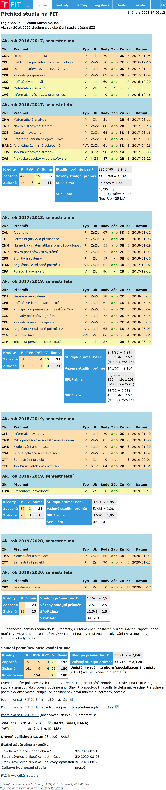

# Sbírka části mého studia na [FIT VUT](https://www.fit.vut.cz/.cs)

## Obsah
- [Sbírka části mého studia na FIT VUT](#sbírka-části-mého-studia-na-fit-vut)
	- [Obsah](#obsah)
- [Některé mé projekty](#některé-mé-projekty)
	- [BIT1 Zimní semestr (2016/2017)](#bit1-zimní-semestr-20162017)
	- [BIT1 Letní semestr (2016/2017)](#bit1-letní-semestr-20162017)
	- [BIT2 Zimní semestr (2017/2018)](#bit2-zimní-semestr-20172018)
	- [BIT2 Letní semestr (2017/2018)](#bit2-letní-semestr-20172018)
	- [BIT3 Zimní semestr (2018/2019)](#bit3-zimní-semestr-20182019)
	- [BIT3 Letní semestr (2018/2019)](#bit3-letní-semestr-20182019)
	- [BIT4 Zimní semestr (2019/2020)](#bit4-zimní-semestr-20192020)
	- [BIT4 Letní semestr (2019/2020)](#bit4-letní-semestr-20192020)
	- [MITAI (2020/2021)](#mitai-20202021)
- [Přehled studia](#přehled-studia)
	- [xxx](#xxx)

# Některé mé projekty

## BIT1 Zimní semestr (2016/2017)
1. [IDA - Diskrétní matematika](subjects/IDA)
2. [IEL - Elektrotechnika pro informační technologie](subjects/IEL)
3. [IUS - Úvod do softwarového inženýrství](subjects/IUS)
4. [IZP - Základy programování](subjects/IZP)

## BIT1 Letní semestr (2016/2017)
1. [INC - Návrh číslicových systémů](subjects/INC)
	- Hodnocení projektu: 20/20
1. [IOS - Operační systémy](subjects/IOS)
	- Hodnocení projektu č.1: 12/15
	- Hodnocení projektu č.2: 14/15
1. [ITW - Tvorba webových stránek](subjects/ITW)
	- Hodnocení projektu č.1: 20/20
	- Hodnocení projektu č.2: 30/20
1. [IVS - Praktické aspekty vývoje software](subjects/IVS)
	- Hodnocení projektu č.1: 12/18
	- Hodnocení projektu č.2: 46/52 (kalkulacka)

## BIT2 Zimní semestr (2017/2018)
1. [IAL - Algoritmy](subjects/)
	- Hodnocení projektu: Společný s IFJ 9/10 + 5/5 obhaj
	- DÚ č.1: 8/10
	- DÚ č.2: 10/10
1. [IFJ - Formální jazyky a překladače](https://github.com/MWarCZ/IFJ17)
	- Hodnocení projektu: 15/15 + 4/5 doku + 5/5 obhaj + 0/5 bonus
	- Téma projektu: IFJcode17
1. [INP - Návrh počítačových systémů](subjects/)
	- Hodnocení projektu č.1: 10/10
	- Hodnocení projektu č.2: 23/23
1. [ISS - Signály a systémy](subjects/)
	- Hodnocení projektu: 10.5/12
1. [IPA - Pokročilé asemblery](subjects/)
	- Hodnocení projektu: 22/24
	- Téma projektu: Hra - strelba **

## BIT2 Letní semestr (2017/2018)
1. [IDS - Databázové systémy](subjects/)
	- Hodnocení projektu: 5/5 + 5/5 + 5/5 + 16/19 (max 34)
1. [IPK - Počítačové komunikace a sítě](subjects/)
	- Hodnocení projektu č.1: 18/20
	- Téma projektu č.1: Klient-server pro získání informace o uživatelích (Ryšavý)
	- Hodnocení projektu č.2: 11/20
	- Téma projektu č.2: Bandwidth Measurement (Ryšavý)
1. [IPP - Principy programovacích jazyků a OOP]([subjects/](https://gitlab.com/MWarCZ/IPPcode18))
	- Hodnocení projektu: 6/6 + 11/14 + bonus 1/5 
	- Téma projektu: IPPcode18
1. [IZG - Základy počítačové grafiky](subjects/)
	- Hodnocení projektu: 11.3/18
2. [IJA - Seminář Java](https://github.com/MWarCZ/IJA)
	- Hodnocení projektu: 80/94

## BIT3 Zimní semestr (2018/2019)
1. [IIS - Informační systémy](https://github.com/MWarCZ/iis)
	- Hodnocení projektu: 30/30
2. [IMP - Mikroprocesorové a vestavěné systémy](subjects/)
	- Hodnocení projektu: 14/14
	- Téma projektu: ESP8266: ovládání LED (IoT, WiFi AP pro mobilní telefon)
2. [ITU - Tvorba uživatelských rozhraní](subjects/)
	- Hodnocení projektu: 42/55
	- Téma projektu: Vizualizace workflow 
2. [ISA - Síťové aplikace a správa sítí](subjects/)
	- Hodnocení projektu: Proj 17/20
	- Téma projektu: Nástroje monitorující a generující zprávy jednoduchých distance-vector protokolů (Dr. Veselý)

## BIT3 Letní semestr (2018/2019)
...

## BIT4 Zimní semestr (2019/2020)
1. [IMS - Modelování a simulace](subjects/IMS) 
	- Hodnocení projektu: 17/20
    - Téma projektu: 4. Uhlíková stopa v zemědělství, lesnictví a zpracovatelském průmyslu

## BIT4 Letní semestr (2019/2020)
1. IBT - Bakalářská práce
   - [Závěrečná práce zveřejněna na webu VUT](https://www.vutbr.cz/studenti/zav-prace?zp_id=129138)
   - [Zdrojové kódy pro backend](https://github.com/MWarCZ/MWEServer)
   - [Zdrojové kódy pro frontend](https://github.com/MWarCZ/MWEClient)

## MITAI (2020/2021)
1. [AVS - Architektury výpočetních systémů](subjects/AVS)
   - Hodnocení projektu č.1: 6/15
   - Hodnocení projektu č.2: 20/25
2. [UPA - Ukládání a příprava dat](https://github.com/xtrnen/UPA-project)
   - Hodnocení projektu: 20/20
   - [Můj fork](https://github.com/MWarCZ/UPA-project)

# Přehled studia
> Sceeen z [WISu](https://wis.fit.vutbr.cz/FIT/)

## xxx
